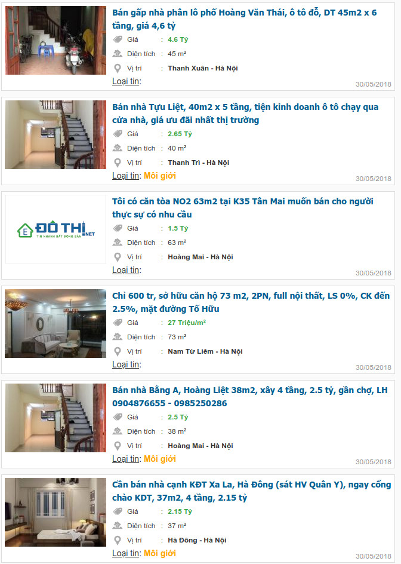

## Takecopter là gì?

Khởi đầu là một tiện ích mở rộng cho trình duyệt Google Chrome, Takecopter giúp đánh dấu các thông tin nhà đất được đưa lên bởi môi giới.
Từ đó người dùng nhanh chóng tìm thấy các thông tin nhà đất chính chủ phù hợp với nhu cầu của mình.

### Cài đặt Takecopter
- Khởi động trình duyệt Google Chrome
- Truy cập vào "Cửa hàng Chrome trực tuyến" tại địa chỉ: <https://chrome.google.com/webstore/category/extensions>
- Gõ từ khóa "Takecopter" vào ô tìm kiếm 
- Nhấn vào nút màu xanh (có dấu + màu trắng ở trên) trong kết quả tìm kiếm Takecopter để cài đặt.

### Sử dụng Takecopter
- Hiện tại Takecopter hỗ trợ lọc tin từ các trang batdongsan.com.vn, dothi.net và muaban.net
- Khi duyệt danh sách tin trên các trang này, nếu tin đó Takecopter thấy là tin môi giới, từ "Môi giới" in đậm màu da cam sẽ xuất hiện ở dòng "Loại tin"

### Liên hệ
- Mọi ý kiến đóng góp cho Takecopter xin gửi về [nhadatchinhchu.info@gmail.com](mailto:nhadatchinhchu.info@gmail.com)
